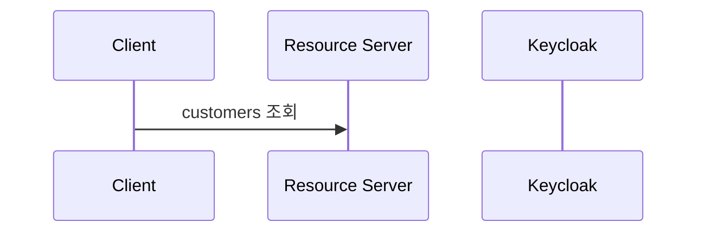

# Keycloak 연동

## 시퀀스 다이어그램



`SecurityConfig.java` 에 다음과 같이 설정하였기 때문에

```java
http.authorizeRequests()
    .antMatchers("/customers*", "/users*")
    .hasRole("user")
```

`/customer` 이동시 인증을 받지 못했다면 로그인 페이지로 이동하게 된다. 로그인 페이지는 `/sso/login`로 Keycloak 라이브러에서 세팅하는것으로 보인다. 로그인 페이지로 이동하게 되면 Keycloak 로그인 페이지로 리다이렉팅 시키게 된다. uri는 다음과 같다. `http://auth-server:9696/auth/realms/SpringBootKeycloak/protocol/openid-connect/auth?response_type=code&client_id=login-app&redirect_uri=http%3A%2F%2F127.0.0.1%3A9797%2Fsso%2Flogin&state=d8a14402-a985-4841-a101-1bc4682e95ac&login=true&scope=openid`.
설정에 의한 것인지 모르겠지만 `state`와 `nonce`는 존재하지 않는다.

### state

CSRF 공격을 막기위한 방법으로 

### nonce
